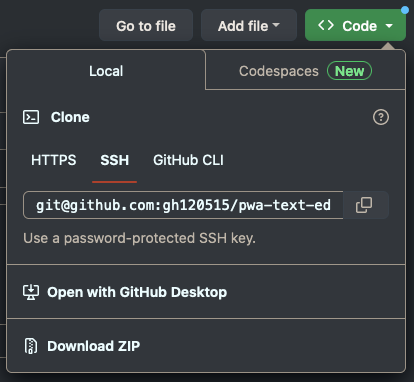
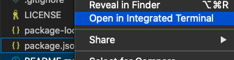
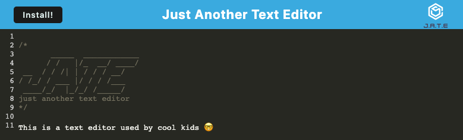

# Browser Text Editor

## Description

This is a JavaScript based web text editor application applicationm using principles of progressive web apps (PWAs). The app can be installed to be used offline.

The app was built to test the builder's knowledge on building a PWA, using technologies such as webpack and service workers.

[Link to the app](https://gh120515-pwa-text-editor-3bfc0f3c0d5b.herokuapp.com/)

## Installation

It is assumed that the user of this app has some basic knowledge in code editing (the app itself can be used through the below steps).

If the user wishes to use the app locally, follow the below steps. If not, access the online version of the app as per the above link.

The following are required to use this app:

1. Download the repository 

You can do this through the 'Code' button above this README; for example, you can clone the repository to your local machine.



2. Node.js

You can skip this step if you already have Node.js in your local machine - you can check your current version in your terminal through the below command:

    node -v

Otherwise, [this link](https://nodejs.dev/en/learn/how-to-install-nodejs/) will highlight some common options to install Node.js - do note that the process may vary between MacOS, Windows and Linux.

Functionality has been confirmed on Node.js version 16.20.0 & version 18.16.0. Note that other versions may not function as intended.

## Usage

After performing the basic setup, open the repository that you downloaded / cloned - you can do this in multiple ways, such as through the terminal.

The most convinient method is through VS Code (source-code editor program), which has a function where you can directly open the terminal in the directory (e.g.) right-click on the root directory folder, then select 'Open in Integrated Terminal'.



After opening the repository directory, do the following:

### Open the terminal in the root directory folder

Then, enter the following to run the app:

```
    <!-- npm i (install) only required for the initial run (will install required dependencies) -->
    npm run install

    <!-- This will start the server as well as build the webpack required to run the webpage -->
    npm run start

```    

2. Access the app locally in your web browser

Once the server has been started, the page can be opened locally at:

    http://localhost:3000/

Enter text as required - it will be saved in the cache, so it will be saved even if you exit the page.



3. (Optional) Install App

Clicking on the 'Install' button will allow you to download the app.

This app can be used offline.

## Credits

Guidelines and starter code by University of Adelaide.

## License

[](https://opensource.org/licenses/MIT)